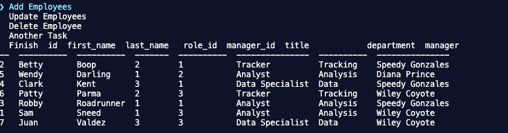

# Employee Contact Mangement System

## Description
A command line application that allows the user to manage employees. When the user starts the application the user is presented with options to view employees, roles, departments and managers. When the user selects one of the lists to view then options for managing tasks for the list are presented to the user. When the user clicks on one of the tasks, the user can add an employee, update an employee, delete an employee, add managers, departments and roles.

***
## Table of Contents
[Installation](#installation) 
[Usage](#usage) 
[Contributing](#contributing) 
[Tests](#tests) 
[License](#license) 
[Questions](#questions) 
***
## Installation
To install the application run npm start from the command line

## Usage
This application is used to manage company employees

* Demo Link: https://drive.google.com/file/d/17VhhDdHR4b0o8fKqpaTFAwbHF8BcjSZk/view

## Contributing
None at this time

## Tests

## License
### This license is covered under the  license(s):
* 
***
## Questions
For more information contact me at: 
* Name: aksmith5239
* GitHub: git@github.com:aksmith5239/employee-cms.git
* Email Address: aklobby@gmail.com
    
